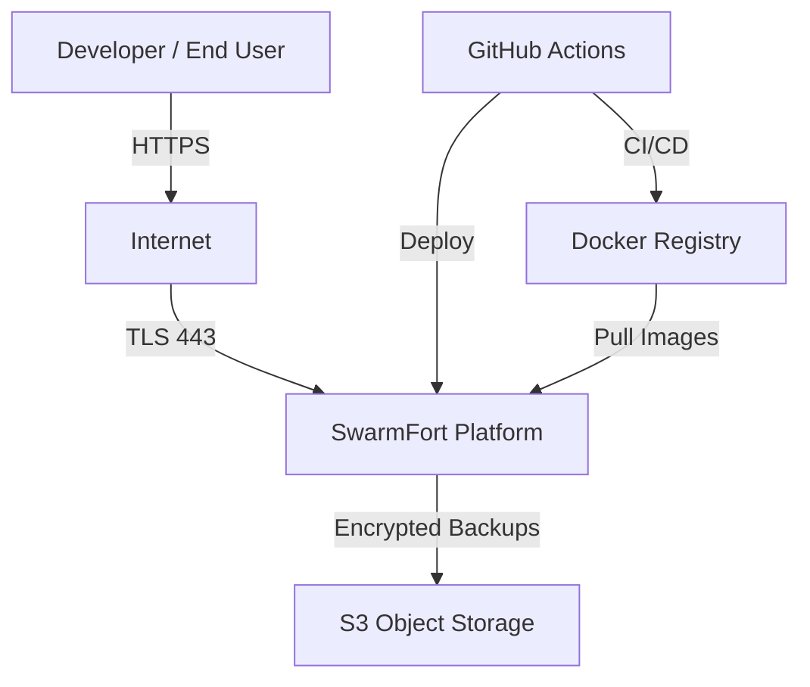
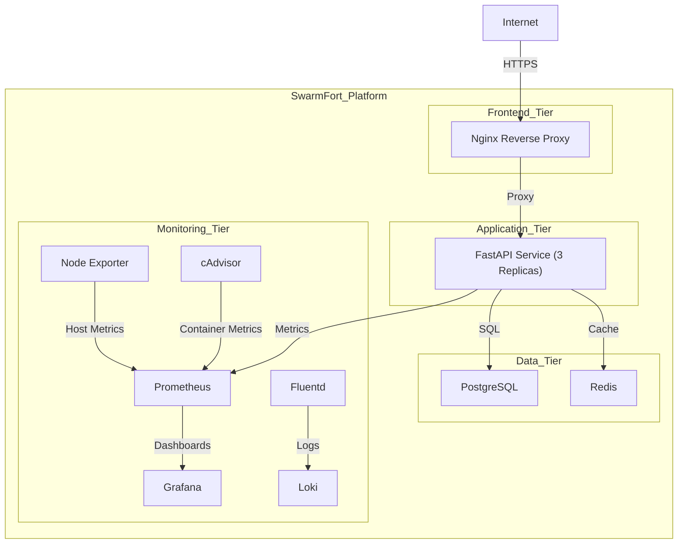
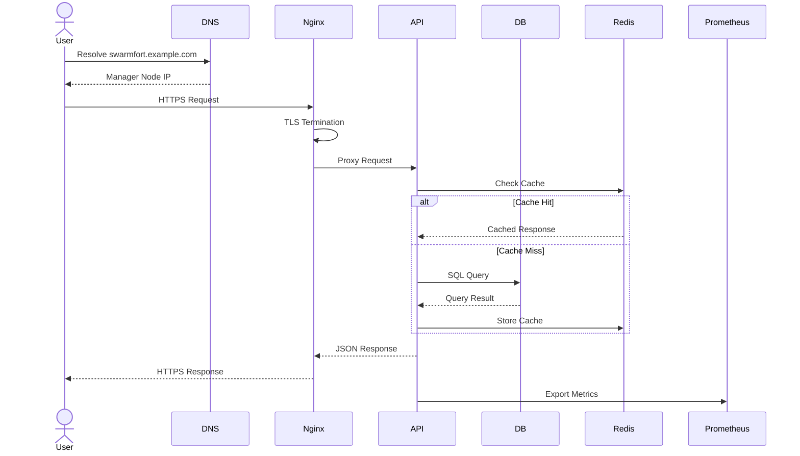
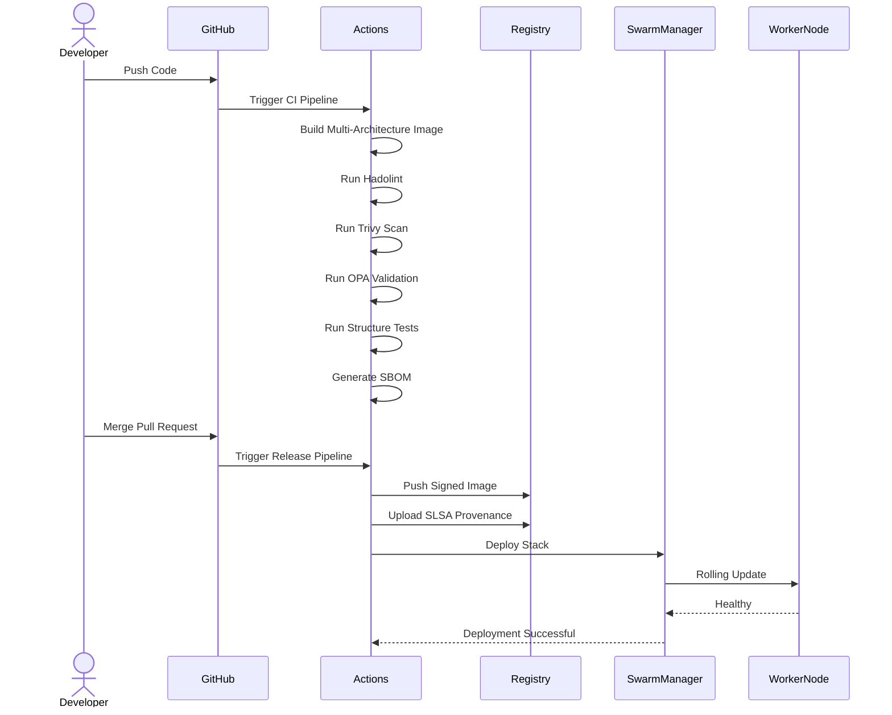
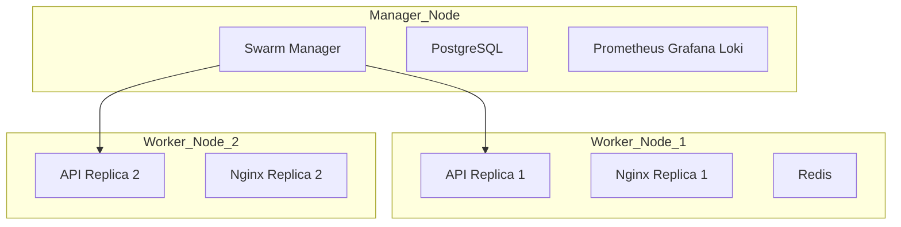

# SwarmFort Architecture

**A production-grade Docker Swarm platform — C4 Model, design decisions, and failure mode analysis.**

---

# 1. System Context (C4 Level 1)

## External Systems

- **Developer / End User** — Accesses APIs and services over HTTPS.
- **GitHub Actions** — CI/CD pipeline responsible for build, scan, signing, and deployment.
- **Docker Registry** — Stores versioned container images.
- **S3 Object Storage** — Stores encrypted backups and archives.

---

# 2. Container Diagram (C4 Level 2)

---

# 3. Sequence Diagram - User Request Flow

---

# 4. Sequence Diagram - CI/CD Deployment Flow

---

# 5. Failure Mode Analysis

| Failure Scenario | Impact | Mitigation | Recovery Time |
|------------------|---------|------------|---------------|
| Manager Node Down | Swarm control plane unavailable while running services continue | Multiple managers recommended; restore from backup | Approximately 10 minutes |
| Worker Node Down | Services rescheduled to remaining nodes | Swarm self-healing | Approximately 30 seconds |
| PostgreSQL Crash | Database-dependent APIs unavailable | Health checks and persistent volumes | Approximately 30 seconds |
| Redis Crash | Increased API latency due to cache misses | Automatic restart | Approximately 30 seconds |
| Nginx Configuration Error | Reverse proxy unavailable | Rolling update rollback | Approximately 20 seconds |
| Docker Daemon Crash | Containers on node affected | Enable live-restore | Approximately 5 seconds |
| Overlay Encryption Key Exposure | Network confidentiality risk | Rotate overlay network encryption | Approximately 5 minutes |
| Registry Unavailable | New deployments blocked | Local image cache | Depends on registry recovery |

---

# 6. Capacity and Scalability

| Metric | Current Capacity | Scaling Strategy |
|----------|----------------|------------------|
| Nodes | 3 | Add additional worker nodes |
| API Replicas | 3 | Increase replica count |
| Database Connections | 100 | PgBouncer connection pooling |
| Redis Memory | 256 MB | Vertical or clustered scaling |
| Containers Per Node | Approximately 100 | Upgrade VM size |
| Network Throughput | Approximately 1 Gbps | Larger VM SKU |
| Log Retention | 7 Days | S3-backed storage |
| Backup Retention | 30 Days | Lifecycle archive policies |

---

# 7. Deployment Diagram

> Swarm may redistribute workloads dynamically based on scheduling decisions and resource availability.

---

# 8. Cost Estimation (Azure Malaysia)

| Resource | Configuration | Monthly Cost |
|-----------|--------------|--------------|
| Virtual Machines | 3 x B2ats_v2 | USD 90 |
| Managed Disks | 3 x 30 GB SSD | USD 15 |
| Public IP | Static | USD 5 |
| Bandwidth | 100 GB | USD 10 |
| Total | Estimated | USD 120 |

> Costs vary by region, discounts, and resource consumption.

---

# 9. Architecture Decision Records

| ID | Decision | Reason |
|------|---------|---------|
| ADR-001 | Docker Swarm | Simpler than Kubernetes |
| ADR-002 | Alpine Images | Smaller footprint |
| ADR-003 | Nginx | Mature reverse proxy |
| ADR-004 | Prometheus Stack | Open-source monitoring |
| ADR-005 | GPG Encryption | Cloud-independent |
| ADR-006 | Overlay Encryption | Native Swarm support |

---

# 10. Technology Stack

| Category | Technology | Version |
|------------|------------|----------|
| Orchestrator | Docker Swarm | 24+ |
| Reverse Proxy | Nginx | Alpine |
| Application | FastAPI | Python 3.12 |
| Database | PostgreSQL | 15 |
| Cache | Redis | 7 |
| Metrics | Prometheus | Latest |
| Dashboard | Grafana | Latest |
| Logging | Loki | Latest |
| Log Shipping | Fluentd | 1.16 |
| Container Metrics | cAdvisor | Latest |
| Host Metrics | Node Exporter | Latest |
| Infrastructure as Code | Terraform | 1.5+ |
| CI/CD | GitHub Actions | Current |
| Image Signing | Cosign and DCT | Current |
| Provenance | SLSA | Level 2+ |
| Security Scanning | Trivy | Latest |
| Policy Validation | OPA Conftest | Latest |
| GitOps | Ansible | Current |

---

# 11. Future Roadmap

- Automatic horizontal scaling
- Let's Encrypt integration
- PostgreSQL high availability
- Multi-cloud deployment modules
- Service mesh support
- Distributed tracing with OpenTelemetry
- Long-term log archival
- Disaster recovery automation

---

# Summary

SwarmFort is a production-focused Docker Swarm platform emphasizing:

- Secure CI/CD pipelines
- Signed container images
- Infrastructure as Code
- Automated recovery
- Observability
- Backup and disaster recovery
- Future scalability

The architecture prioritizes operational simplicity while maintaining production-grade reliability and security.