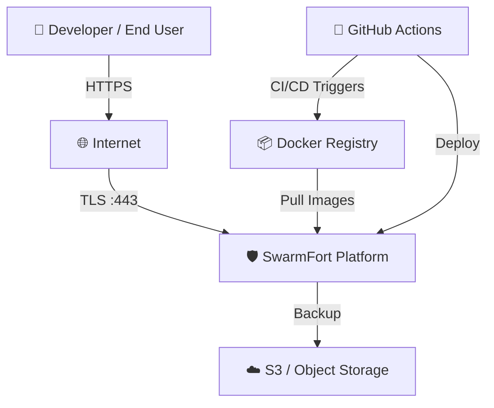
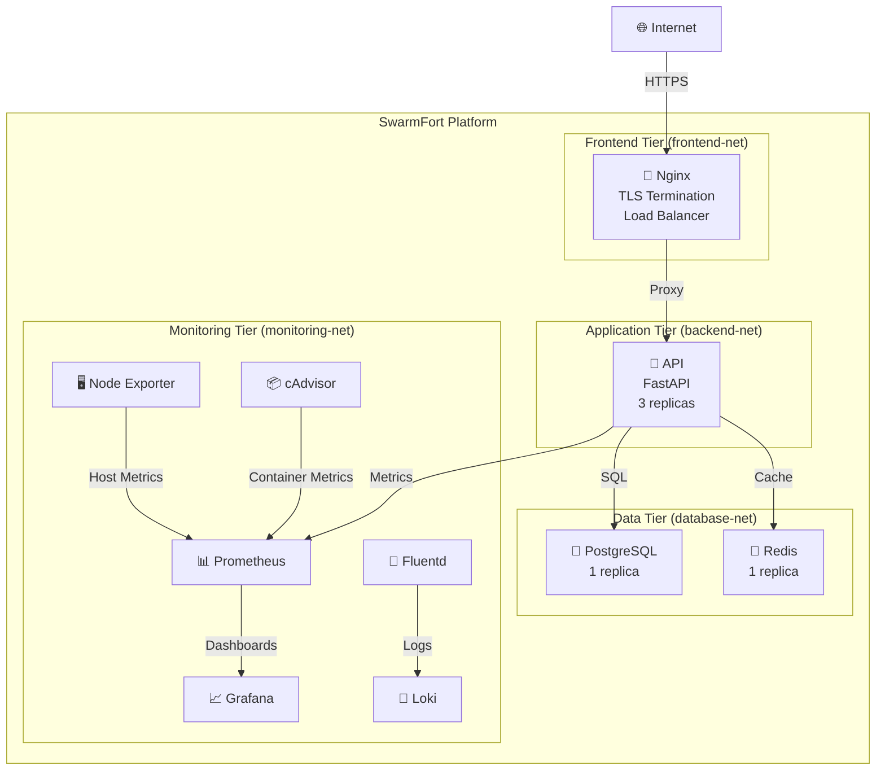
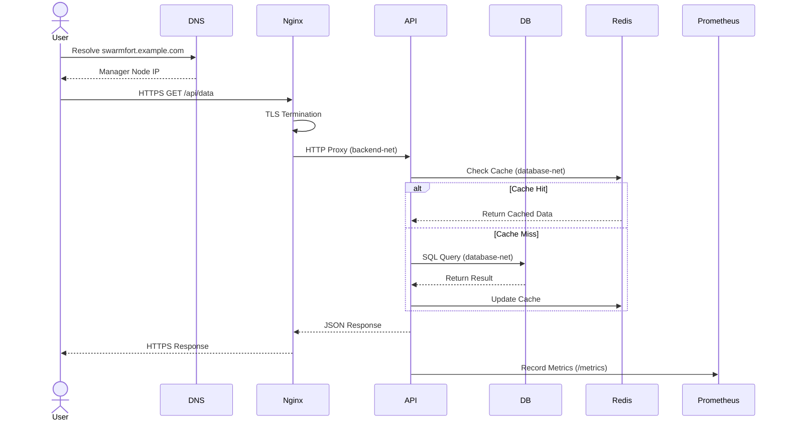
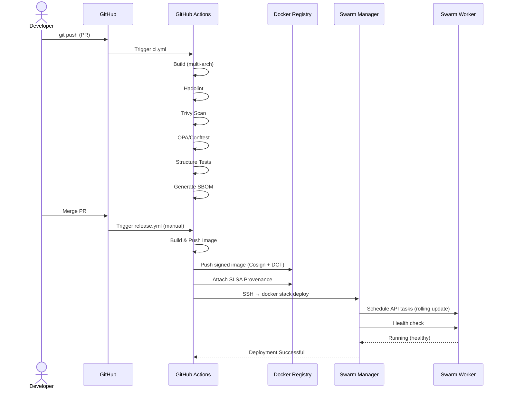
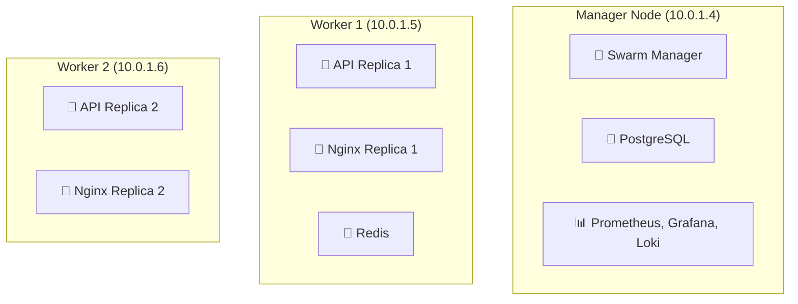

```markdown
# SwarmFort Architecture

**A production-grade Docker Swarm platform — C4 Model, design decisions, and failure mode analysis.**

---

## 1. System Context (C4 Level 1)



**External Systems:**
- **Developer / End User** — Accesses the API via HTTPS.
- **GitHub Actions** — CI/CD pipeline; builds, scans, signs, and deploys images.
- **Docker Registry** — Stores signed, multi-arch images.
- **S3 / Object Storage** — Stores encrypted backups.

---

## 2. Container Diagram (C4 Level 2)



---

## 3. Sequence Diagram: User Request Flow



---

## 4. Sequence Diagram: CI/CD Deployment Flow



---

## 5. Failure Mode Analysis

| Failure Scenario | Impact | Mitigation | Recovery Time |
|-----------------|--------|------------|---------------|
| **Manager Node Down** | Swarm control plane unavailable; existing services continue running | Multiple managers (not yet implemented); `backup-swarm.sh` for fast recovery | ~10 min (restore from backup) |
| **Worker Node Down** | Services reschedule to remaining nodes | Swarm self-healing; `kill-random-node.sh` chaos test validates this | ~30 sec (Swarm reschedule) |
| **PostgreSQL Crash** | API returns 500 for DB-dependent endpoints | Health check (`pg_isready`) triggers restart; volume persistence | ~30 sec (container restart) |
| **Redis Crash** | Cache misses; API still functional but slower | Health check triggers restart; stateless | ~30 sec |
| **Nginx Config Error** | 502 Bad Gateway for all requests | Rolling update failure_action=rollback; previous config restored | ~20 sec (rollback) |
| **Docker Daemon Crash** | All containers on that node stop | `live-restore: true` in daemon.json; containers continue running during daemon restart | ~5 sec (daemon restart) |
| **IPsec Key Compromise** | Overlay traffic potentially decryptable | `overlay-encryption-rotation.sh` creates new network, migrates services | ~5 min (automated rotation) |
| **Registry Unavailable** | Cannot pull new images; existing containers unaffected | Docker Hub/self-hosted registry HA; local image cache on nodes | Varies (depends on registry recovery) |

---

## 6. Capacity & Scalability

| Metric | Current Limit | Scaling Strategy |
|--------|--------------|------------------|
| **Nodes** | 3 (1 manager + 2 workers) | Add workers via `join-worker.sh`; promote additional managers for HA |
| **API Replicas** | 3 (configurable) | Increase `replicas` in stack; Swarm load balances automatically |
| **Database Connections** | PostgreSQL default (100) | Connection pooling via PgBouncer; vertical scaling for DB VM |
| **Redis Memory** | 256 MB limit | Vertical scaling; or Redis Cluster for horizontal scaling |
| **Max Containers** | ~100 per node (B2ats_v2) | Upgrade VM SKU; distribute services across more nodes |
| **Network Throughput** | ~1 Gbps (Azure B2ats_v2) | Upgrade VM size; IPsec overhead ~5-8% |
| **Log Retention** | Loki: 7 days (default) | Increase `retention_period` in Loki config; add S3 backend |
| **Backup Retention** | 30 days (local) | S3 lifecycle policy for long-term archival |

---

## 7. Deployment Diagram: Node Distribution



> **Note:** This is the default placement. Swarm may redistribute based on resource availability and constraints.

---

## 8. Cost Estimation (Azure - Malaysia West)

| Resource | SKU | Monthly Cost (USD) |
|----------|-----|-------------------|
| 3 × VMs (B2ats_v2) | 2 vCPU, 4 GB RAM | ~$90 |
| 3 × Managed Disks (30 GB) | Standard SSD | ~$15 |
| Public IP | Static | ~$5 |
| Bandwidth (outbound) | ~100 GB estimated | ~$10 |
| **Total (estimated)** | | **~$120/month** |

> Costs are approximate and vary by region, usage, and reserved instance discounts.

---

## 9. Architecture Decision Records (ADR)

| ID | Title | Decision | Rationale |
|----|-------|----------|-----------|
| ADR-001 | Swarm over Kubernetes | Use Docker Swarm | Simpler, built-in, no etcd; sufficient for teams < 50 |
| ADR-002 | Alpine over Distroless | Use Alpine as base | Smaller than distroless, package manager for debugging |
| ADR-003 | Nginx over Traefik | Use Nginx | More mature, easier custom config |
| ADR-004 | Prometheus over Datadog | Use Prometheus stack | Open source, no vendor lock-in, Swarm-native |
| ADR-005 | GPG over Cloud KMS | Use GPG symmetric | Portable across clouds, simpler key management |
| ADR-006 | IPsec over mTLS | Use IPsec overlay encryption | Built into Swarm, no sidecar needed, transparent to apps |

> Full ADR documents available in `docs/adr/` directory.

---

## 10. Technology Stack

| Category | Technology | Version |
|----------|-----------|---------|
| Orchestrator | Docker Swarm | 24+ |
| Ingress | Nginx | Alpine |
| Application | Python FastAPI | 3.12 |
| Database | PostgreSQL | 15 |
| Cache | Redis | 7 |
| Metrics | Prometheus | Latest |
| Dashboards | Grafana | Latest |
| Logs | Loki | Latest |
| Log Shipper | Fluentd | v1.16 |
| Container Metrics | cAdvisor | Latest |
| Host Metrics | Node Exporter | Latest |
| IaC | Terraform | 1.5+ |
| CI/CD | GitHub Actions | - |
| Signing | Cosign, DCT | - |
| Provenance | SLSA | L2+ |
| Security Scan | Trivy | Latest |
| Policy Engine | OPA/Conftest | Latest |
| GitOps | Ansible (primary), Flux (optional) | - |

---

## 11. Future Considerations

- **Auto-scaling**: Docker Swarm autoscaler with Prometheus metrics triggers
- **Let's Encrypt**: Replace self-signed certificates with cert-manager
- **PostgreSQL HA**: Patroni or pgpool for automatic failover
- **Multi-cloud**: Terraform modules for AWS, GCP, on-premise
- **Service Mesh**: Istio or Consul Connect for mTLS (currently IPsec suffices)
- **Distributed Tracing**: OpenTelemetry + Jaeger/Tempo

---

।