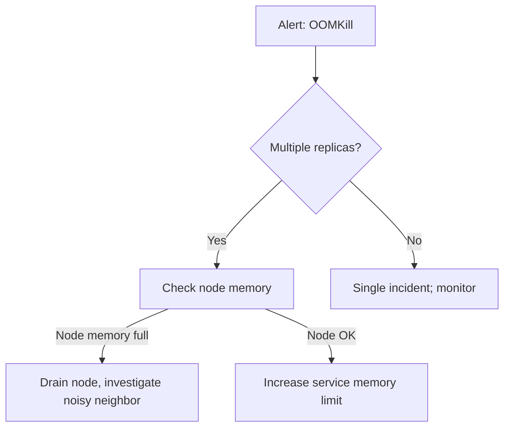
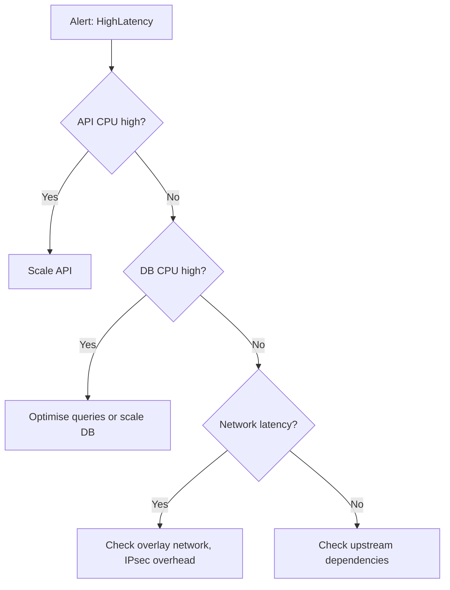
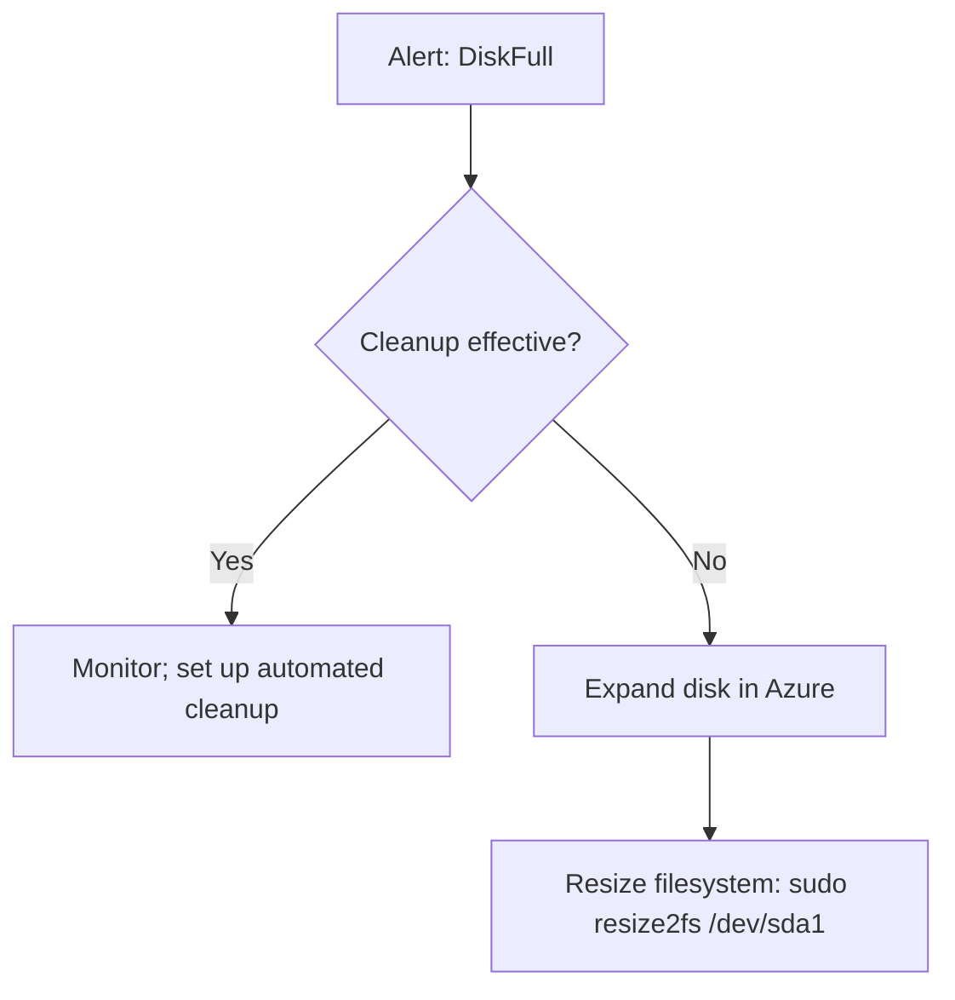
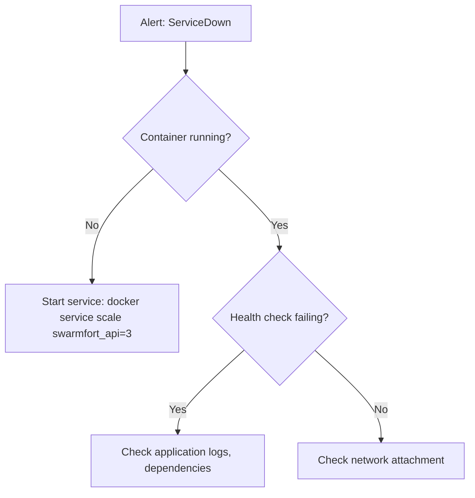

```markdown
# SwarmFort Runbook

**Operational procedures for deploying, monitoring, recovering, and maintaining the SwarmFort platform—designed for SRE‑driven operations.**

---

## 1. Platform Overview & SLO

SwarmFort is a secure, observable Docker Swarm platform running on Microsoft Azure, provisioned with Terraform. All commands assume the project root and a configured `make` environment.

### Service Level Objectives (SLO)

| Service       | SLO                    | Measurement Window |
|---------------|------------------------|--------------------|
| API           | 99.9% availability     | 30 days            |
| API p95 latency | < 300ms               | 30 days            |

**Error Budget Policy**  
- Monthly error budget: **43 minutes** of downtime.  
- If budget consumption exceeds **50%** in the first week, all feature deployments are frozen until the budget is restored.  
- Budget burn alerts are visible in Prometheus / Grafana.

---

## 2. Infrastructure Provisioning (Terraform + Azure)

All cloud resources are defined in `infra/terraform/`.

### 2.1 Prerequisites
- Azure CLI installed & authenticated (`az login`)
- Terraform ≥ 1.5
- SSH key pair (`~/.ssh/id_rsa` and `~/.ssh/id_rsa.pub`)

### 2.2 Provisioning Commands
```bash
cd infra/terraform
terraform init
terraform plan
terraform apply -auto-approve
terraform output
```
Or from the project root: `make infra-up` (which also initialises Swarm).

### 2.3 Remote State (Team Use)
To share state, add a backend block to `infra/terraform/backend.tf`:
```hcl
terraform {
  backend "azurerm" {
    resource_group_name  = "swarmfort-state"
    storage_account_name = "swarmforttfstate"
    container_name       = "tfstate"
    key                  = "prod.terraform.tfstate"
  }
}
```

### 2.4 Destroying Infrastructure
```bash
cd infra/terraform
terraform destroy -auto-approve
```
Or from root: `make infra-down`

---

## 3. Swarm Cluster Operations

### 3.1 Cluster Initialisation
Automatically performed by `make infra-up`. The script `init-cluster.sh`:
- Initialises Swarm on the manager
- Creates the encrypted overlay network (`--opt encrypted`)

Workers are joined with `join-worker.sh`.

### 3.2 Node Management
| Action        | Command |
|---------------|---------|
| List nodes    | `docker node ls` |
| Drain node    | `docker node update --availability drain <hostname>` |
| Activate node | `docker node update --availability active <hostname>` |
| Remove node   | `docker node rm <id>` (after `docker swarm leave` on worker) |

### 3.3 Stack Deployment
```bash
make deploy-stack
```
Manually:
```bash
scp infra/docker/docker-stack.yml infra/docker/nginx.conf azureuser@<manager>:/tmp/
ssh azureuser@<manager> "docker stack deploy -c /tmp/docker-stack.yml swarmfort"
```

### 3.4 Service Management
| Action          | Command |
|-----------------|---------|
| List services   | `docker service ls` |
| Inspect service | `docker service ps swarmfort_api` |
| Logs            | `docker service logs swarmfort_api` |
| Scale           | `docker service scale swarmfort_api=5` |
| Force restart   | `docker service update --force swarmfort_api` |

---

## 4. Deployment & Rollback

### 4.1 Rolling Update
Configured in `docker-stack.yml`:
```yaml
update_config:
  parallelism: 1
  delay: 10s
  failure_action: rollback
```
Trigger an update:
```bash
docker service update --image myrepo/swarmfort-api:latest swarmfort_api
```

### 4.2 Rollback
```bash
docker service rollback swarmfort_api
```
Swarm reverts to the previous image and configuration.

### 4.3 Canary Deployment
1. Deploy a canary stack (e.g., `swarmfort-canary`) with a small traffic weight.
2. Run `./infra/swarm-scripts/promote-canary.sh swarmfort_api 10`.
3. The script checks Prometheus error rates; if healthy, promotes the canary to full traffic.
4. Otherwise, automatic rollback.

---

## 5. Backup & Restore

### 5.1 Automated Backups
Daily backups via GitHub Actions (`backup.yml`) or manually:
```bash
make backup
```
The script:
- Tars `/var/lib/docker/swarm`
- Encrypts with GPG (passphrase from `BACKUP_ENCRYPTION_KEY`)
- Saves to `/backups/swarm/` (optionally uploads to S3)

### 5.2 Volume Backup
Database volume is also backed up using `docker run --volumes-from` (included in the same script).

### 5.3 Restore
```bash
make restore
```
Interactive: select the backup file.
Manual steps:
1. Copy backup to new manager: `scp backup.tar.gz.gpg azureuser@<new-manager>:/tmp/`
2. Decrypt and extract: `gpg --decrypt backup.tar.gz.gpg | tar xzf - -C /`
3. Re-init Swarm if needed: `docker swarm init --force-new-cluster`
4. Deploy stack: `make deploy-stack`

---

## 6. Logging & Monitoring

### 6.1 Accessing Logs
- **Grafana Explore (Loki)**: `http://<manager>:3000/explore`
- **Service logs**: `docker service logs swarmfort_api`
- **Docker events**: streamed to Loki by `docker-events-exporter.sh`

### 6.2 Metrics & Dashboards
- **Prometheus**: `http://<manager>:9090`
- **Grafana**: `http://<manager>:3000` (admin/admin)
  - API RED (Rate, Errors, Duration)
  - Resource Usage (CPU, Memory, Disk, Network)

### 6.3 Prometheus Targets
```bash
curl -s http://<manager>:9090/api/v1/targets | jq '.data.activeTargets[] | {job: .labels.job, health: .health}'
```
All should show `"health": "up"`.

---

## 7. Alert Handling (Alert-Driven Runbook)

### 7.1 OOMKillDetected

**Severity:** Critical  
**SLO Impact:** Potential availability drop if multiple replicas are killed.  
**Escalation:** If unresolved for 15 minutes → page on-call SRE via PagerDuty.

#### Investigation
1. Identify killed container:
   ```bash
   docker service ps swarmfort_api --format '{{.CurrentState}}' | grep OOM
   ```
2. Check memory usage:
   ```bash
   curl -s http://<manager>:9090/api/v1/query?query=container_memory_usage_bytes{name="swarmfort_api"}
   ```
3. Check node memory:
   ```bash
   ssh <node> free -h
   ```

#### Immediate Mitigation
- Increase memory limit temporarily:
  ```bash
  docker service update --limit-memory 1G swarmfort_api
  ```
- Scale up replicas to reduce per‑replica load:
  ```bash
  docker service scale swarmfort_api=5
  ```

#### Long‑term Fix
- Profile application memory; update default limits in `docker-stack.yml`.
- Consider adding a memory-based autoscaler.

#### Troubleshooting Flowchart (OOMKill)


---

### 7.2 HighLatency

**Severity:** Warning  
**SLO Impact:** p95 latency exceeds 1s; error budget consumption may increase.

#### Investigation
1. Check Prometheus latency panel in Grafana.
2. Identify slow endpoints:
   ```bash
   curl -s http://<manager>:9090/api/v1/query?query=histogram_quantile(0.95, sum(rate(http_request_duration_seconds_bucket[5m])) by (le, endpoint))
   ```
3. Check database query performance:
   ```bash
   docker exec <db-container> psql -U user -d mydb -c "SELECT query, mean_exec_time FROM pg_stat_statements ORDER BY mean_exec_time DESC LIMIT 5;"
   ```

#### Mitigation
- Scale API replicas:
  ```bash
  docker service scale swarmfort_api=5
  ```
- Restart Redis if cache misses are high:
  ```bash
  docker service update --force swarmfort_redis
  ```

#### Troubleshooting Flowchart (HighLatency)


---

### 7.3 DiskFull

**Severity:** Critical  
**SLO Impact:** Service failure if disk reaches 100%.

#### Investigation
1. Check disk usage:
   ```bash
   ssh <node> df -h
   ```
2. Identify large directories:
   ```bash
   ssh <node> du -sh /var/lib/docker/* | sort -h
   ```

#### Mitigation
- Immediate cleanup:
  ```bash
  make cleanup-disk
  ```
- If insufficient, expand OS disk in Azure portal and resize filesystem.

#### Troubleshooting Flowchart (DiskFull)


---

### 7.4 ServiceDown

**Severity:** Critical  
**SLO Impact:** Immediate user impact.

#### Investigation
1. Check service status:
   ```bash
   docker service ps swarmfort_api
   ```
2. Inspect logs:
   ```bash
   docker service logs --tail 100 swarmfort_api
   ```
3. Verify overlay network connectivity:
   ```bash
   docker network inspect backend-net | jq '.[0].Containers'
   ```

#### Mitigation
- Force restart:
  ```bash
  docker service update --force swarmfort_api
  ```
- If image corruption suspected, redeploy:
  ```bash
  make deploy-stack
  ```

#### Troubleshooting Flowchart (ServiceDown)


---

## 8. Escalation Matrix

| Severity | Initial Response | Escalate to | After |
|----------|-----------------|-------------|-------|
| **Critical** (e.g., OOMKill, ServiceDown) | On‑call SRE (PagerDuty) | Lead SRE + Dev lead | 30 min unresolved |
| **Warning** (e.g., HighLatency, HighCPU) | Slack #sre‑swarmfort | Lead SRE | 2 hours unresolved |
| **Info** (e.g., DiskFull pre‑warning) | Email to team | None | – |

---

## 9. Diagnostic Automation

A **diagnostic script** (`infra/swarm-scripts/diagnostic.sh`) can be run on the manager to collect essential information quickly. Example content:

```bash
#!/bin/bash
echo "== Node Status =="
docker node ls
echo "== Service Status =="
docker service ls
echo "== Prometheus Targets =="
curl -s http://localhost:9090/api/v1/targets | jq '.data.activeTargets[] | {job: .labels.job, health: .health}'
echo "== Disk Usage =="
df -h
echo "== Memory Usage =="
free -h
```

Run it during any incident:
```bash
ssh azureuser@<manager> ./diagnostic.sh
```
This output can be attached to incident tickets.

---

## 10. Post‑Incident Review (Postmortem)

### Postmortem Template
```markdown
## Incident Postmortem

- **Incident ID**: SWARM-YYYY-MM-DD-001
- **Date**: 
- **Duration**:
- **Severity**:
- **Impact**:
- **Trigger**:
- **Root Cause**:
- **Timeline** (all times UTC):
  - HH:MM Alert fired
  - HH:MM SRE acknowledged
  - HH:MM Diagnosis began
  - HH:MM Mitigation applied
  - HH:MM Service restored
- **Detection**: How was it detected? Could it have been caught earlier?
- **Resolution**:
- **Action Items**:
  - [ ] Fix root cause (link to issue)
  - [ ] Update runbook (if applicable)
  - [ ] Add/improve monitoring/alerting
  - [ ] Follow‑up date:
- **Lessons Learned**:
```
Postmortems must be **blameless** and shared with the team.

---

## 11. Secret Rotation

Rotate DB password and API key:
```bash
make rotate-secrets
```
Or manually via `rotate-secrets.sh` on the manager.

---

## 12. Disk Cleanup

```bash
make cleanup-disk
```
Runs `docker system prune -af --filter "until=72h"` and `docker volume prune -f`.  
Nightly cron via `cleanup-cron-setup.sh`.

---

## 13. Network Encryption Key Rotation

Rotate IPsec keys for any encrypted overlay network:
```bash
ssh azureuser@<manager> ./overlay-encryption-rotation.sh <network-name>
```
Migrates services to a new network transparently.

---

## 14. Maintenance Procedures

### 14.1 OS Patches
1. Drain node: `docker node update --availability drain <node>`
2. SSH and upgrade: `sudo apt update && sudo apt upgrade -y`
3. Reboot if required
4. Activate: `docker node update --availability active <node>`

### 14.2 Docker Upgrade
1. Drain workers first, manager last.
2. Upgrade: `sudo apt install --only-upgrade docker-ce docker-ce-cli containerd.io`
3. Restart Docker: `sudo systemctl restart docker`
4. Activate node.

> Swarm’s `live-restore` keeps containers running during Docker restart.

### 14.3 TLS Certificate Renewal
Self‑signed certificates expire in 365 days. Renew with:
```bash
make setup-tls
docker service update --force swarmfort_nginx
```

---

## 15. Quick Reference Card

| Operation | Command |
|-----------|---------|
| Full deploy | `make demo` |
| Deploy stack | `make deploy-stack` |
| Scale API | `docker service scale swarmfort_api=5` |
| View logs | `docker service logs swarmfort_api` |
| Rollback API | `docker service rollback swarmfort_api` |
| Backup | `make backup` |
| Restore | `make restore` |
| Disk cleanup | `make cleanup-disk` |
| Rotate secrets | `make rotate-secrets` |
| Node drain | `docker node update --availability drain <node>` |
| Node activate | `docker node update --availability active <node>` |
| Check cluster | `docker node ls` |
| Check services | `docker service ls` |
| Check Prometheus targets | `curl -s http://<manager>:9090/api/v1/targets` |
| Grafana | `http://<manager>:3000` (admin/admin) |
| Diagnostic script | `ssh azureuser@<manager> ./diagnostic.sh` |

---

**SwarmFort Runbook** – Operational excellence through SRE principles. Keep this document alive; update after every incident.```