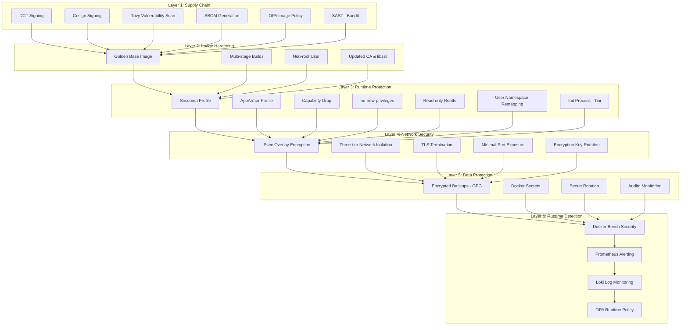

# SwarmFort Security Hardening

**Implementation details, risk analysis, compliance mapping, and verifiable controls for every security layer in the platform.**

---

## 1. Security Philosophy

SwarmFort follows a **defense-in-depth** strategy. No single layer is trusted to provide complete protection. Instead, multiple overlapping controls ensure that if one layer fails, others still prevent or detect compromise.

### Core Principles
- **Least Privilege**: Every process, container, and service runs with the minimum permissions required.
- **Secure by Default**: All security features are enabled out of the box; opt-out requires explicit configuration.
- **Shift Left**: Security checks begin at the pull request (CI) and continue through deployment to runtime.
- **Zero Trust**: No implicit trust between services, even within the same cluster. All inter-service traffic is encrypted.
- **Immutable Infrastructure**: Containers are ephemeral; persistent state is encrypted and backed up.
- **Measurable Security**: All controls are tied to defined metrics and SLOs to track effectiveness.

### Defense-in-Depth Layers



---

## 2. Supply Chain Security (Layer 1)

### 2.1 Docker Content Trust (DCT)

**Implementation:**  
- Root key stored **offline** (never touches a network-connected machine).  
- Delegation roles defined in `infra/security/content-trust/delegation-roles.json`:  
  - `releaser` – can sign any image in the repository.  
  - `signer` – restricted to `swarmfort-api/*`.  
- Images are signed with `docker trust sign`.

**Why:**  
Prevents tampered or malicious images from being pulled. Even if the registry is compromised, unsigned or incorrectly signed images are rejected. Offline root key ensures that even CI/CD compromise cannot rotate the root of trust.

**Enforcement:**  
`DOCKER_CONTENT_TRUST=1` is set during production pulls (`make dct-pull`). Swarm nodes pull only signed images.

**Verification:**
```bash
DOCKER_CONTENT_TRUST=1 docker pull myrepo/swarmfort-api:latest
# Fails if image is not signed
```

### 2.2 Cosign Keyless Signing

**Implementation:**  
- Cosign signs images in the `release.yml` GitHub Actions workflow.  
- Uses **keyless signing** (OIDC-based) with the GitHub Actions identity.  
- Signature stored in the registry alongside the image.

**Why:**  
Provides a second, independent signature mechanism. Keyless signing eliminates the need to manage long-lived private keys. Cosign signatures are verifiable without access to a private key, using the GitHub OIDC identity.

**Verification:**
```bash
cosign verify \
  --certificate-identity "https://github.com/your-org/SwarmFort/.github/workflows/release.yml@refs/heads/main" \
  --certificate-oidc-issuer "https://token.actions.githubusercontent.com" \
  myrepo/swarmfort-api:latest
```

### 2.3 SLSA Provenance (Level 2+)

**Implementation:**  
- SLSA provenance generated by `slsa-framework/slsa-github-generator` in `release.yml`.  
- Attested artifact includes build configuration, source repository, and build environment.  
- Policy defined in `infra/security/slsa-provenance-policy.yaml`.

**Why:**  
Provides verifiable proof of how and where the image was built. Prevents supply chain attacks that inject code during the build process. SLSA Level 2+ ensures the build was executed in a trusted CI/CD environment with source code integrity.

**Enforcement:**  
OPA/Cosign policy verifies provenance before deployment.

### 2.4 Trivy Vulnerability Scanning

**Implementation:**  
- **Pull Request:** Scans for HIGH and CRITICAL CVEs (`ci.yml`). PR is blocked if any are found.  
- **Nightly:** Full scan of all severities (`security-scan.yml`). Results uploaded as SARIF artifact.

**Why:**  
Catches known vulnerabilities before they reach production. PR-gating prevents new CVEs from being introduced. Nightly scans detect newly discovered vulnerabilities in existing images.

### 2.5 SBOM Generation

**Implementation:**  
- Anchore SBOM Action generates SPDX JSON with every CI run.  
- SBOM artifact uploaded and stored alongside the release.

**Why:**  
Provides a complete bill of materials for compliance (e.g., executive orders, customer audits). Enables quick identification of affected components when new CVEs are disclosed.

### 2.6 OPA Image Policy

**Implementation:**  
`infra/security/opa-policies/image-policy.rego`:
```rego
package docker.image

default allow = false

allow {
    input.Image.Labels["com.example.sec-approved"] == "true"
}

allow {
    input.Image.Signatures[_].signed == true
}
```

**Why:**  
Policy-as-code ensures only approved images are deployed. The `com.example.sec-approved=true` label indicates the image passed all security checks (scanning, signing). The signature check provides defense-in-depth.

**Enforcement:**  
Checked by Conftest in CI (`ci.yml` → `opa-conftest` job). Fails the build if policy is violated.

### 2.7 Application Security Testing (SAST)

**Implementation:**  
- **Bandit** scans Python code for common security issues (e.g., SQL injection, hardcoded passwords) in the CI pipeline.  
- **Dependency review** (Dependabot/Renovate) alerts on vulnerable packages and opens automated PRs.  
- **Pre-commit hooks** (trufflehog) scan for secrets before code is committed.

**Why:**  
Platform security is only as strong as the application running on it. SAST catches code-level vulnerabilities early in the development lifecycle, reducing the risk of deploying exploitable applications. Dependency scanning ensures third-party libraries are kept up to date.

**Enforcement:**  
Bandit results are reviewed in the `ci.yml` workflow. High-severity findings block the PR.

---

## 3. Image Hardening (Layer 2)

### 3.1 Golden Base Image

**Implementation:**  
`infra/docker/Dockerfile.base`:
- Starts from `python:3.12-alpine`.  
- Updates all packages (`apk update && apk upgrade`).  
- Installs `ca-certificates`, `libressl` (instead of OpenSSL for reduced attack surface), `tzdata`.  
- Creates directory for custom CA certificates.  
- Creates non-root user `appuser` (UID 1001, GID 1001).  
- Updates libssl symlink to the patched version.

**Why:**  
A single, hardened base image ensures all derived application images inherit security fixes and configurations. Patching the base image once updates all services. Custom CA support enables internal PKI without modifying application code.

### 3.2 Multi-stage Builds

**Implementation:**  
`app/Dockerfile` (and `Dockerfile.prod`) use two stages:  
1. **Builder stage** – installs compilers, builds dependencies, creates wheels.  
2. **Production stage** – copies only the built artifacts, no compilers or development headers.

**Why:**  
Reduces final image size (< 25MB) and attack surface. Build tools (gcc, musl-dev) are never present in the running container, eliminating an entire class of attacks that exploit compilers or development libraries.

### 3.3 Non-root User

**Implementation:**  
- `USER appuser` (UID 1001) set in the golden base image and inherited by all derived images.  
- Verified by Container Structure Tests (`user: "appuser"`).

**Why:**  
If a container is compromised, the attacker gains only the privileges of `appuser`, not root. This mitigates container escape vulnerabilities and limits the impact of any application-level exploit.

### 3.4 Updated CA & libssl

**Implementation:**  
- Custom CA directory (`/usr/local/share/ca-certificates/custom`) prepared for enterprise PKI.  
- `libressl` installed as a more secure alternative to OpenSSL (fewer CVEs historically).  
- libssl symlink updated to the latest patched version.

**Why:**  
Ensures TLS connections from the container use trusted, up-to-date certificate authorities. Reduces exposure to OpenSSL vulnerabilities.

---

## 4. Runtime Protection (Layer 3)

### 4.1 Custom Seccomp Profile

**Implementation:**  
`infra/security/seccomp-profiles/custom-seccomp.json`:
- **Default action:** `SCMP_ACT_ERRNO` (deny all syscalls not explicitly allowed).  
- **Allowed syscalls:** ~60 carefully selected calls required by Python/FastAPI: `read`, `write`, `openat`, `close`, `fstat`, `mmap`, `mprotect`, `clone`, `futex`, `socket`, `bind`, `listen`, `accept`, `connect`, `epoll_*`, `rt_sig*`, `ioctl`, `fcntl`, `brk`, `nanosleep`, `getpid`, `gettid`, `uname`, `prctl`, `sched_yield`, `set_robust_list`, etc.  
- **Architectures:** `amd64` and `arm64` (multi-arch support).  
- **Blocked examples:** `ptrace`, `mount`, `chown`, `reboot`, `kexec_load`, `init_module`, `delete_module`, `bpf`.

**Why:**  
Seccomp (Secure Computing Mode) is a Linux kernel feature that restricts the syscalls a process can make. A container running with our custom profile **cannot**:
- Mount filesystems (prevents container escape via mount)
- Load kernel modules (prevents kernel-level rootkits)
- Trace other processes (prevents credential theft via ptrace)
- Reboot the host

This dramatically reduces the kernel attack surface. Even a kernel vulnerability in an unused syscall is unexploitable.

**Verification:**
```bash
docker inspect swarmfort_api --format '{{json .HostConfig.SeccompProfile}}' | jq .
# Should show the custom profile path, not "unconfined"
```

### 4.2 Custom AppArmor Profile

**Implementation:**  
`infra/security/apparmor-profiles/usr.bin.custom-app`:
```
profile custom-app /usr/local/bin/python3 {
  #include <abstractions/base>
  #include <abstractions/python>
  #include <abstractions/ssl_certs>

  network inet stream,
  network inet dgram,
  network inet6 stream,
  network inet6 dgram,

  /app/** r,
  /home/appuser/.local/** r,
  /home/appuser/.local/** ix,

  /tmp/** rw,
  /var/run/** rw,

  deny /etc/shadow r,
  deny /root/** r,
  deny /home/** rw,
}
```

**Why:**  
AppArmor provides **mandatory access control (MAC)** — even if a process runs as root (before user namespace remapping), it cannot access files or network resources outside the profile. Our profile:
- Allows only the specific Python binary (`/usr/local/bin/python3`).
- Denies access to `/etc/shadow` (password hashes).
- Denies access to `/root` and other home directories.
- Allows only necessary network protocols (TCP/UDP on IPv4/IPv6).

**Verification:**
```bash
# On the host
sudo aa-status | grep custom-app
# Should show the profile as loaded and in enforce mode

# Verify the container is using the profile
docker inspect swarmfort_api --format '{{.HostConfig.AppArmorProfile}}'
# Should output "custom-app"
```

### 4.3 Capability Dropping

**Implementation:**  
In `docker-stack.yml`:
```yaml
cap_drop:
  - ALL
cap_add:
  - NET_BIND_SERVICE  # Only if needed (API binding to port 8000)
```

**Why:**  
Linux capabilities break down the monolithic root privilege into distinct units. By dropping all capabilities and only adding `NET_BIND_SERVICE`, the container cannot:
- Change file ownership (`CAP_CHOWN`)
- Override DAC (`CAP_DAC_OVERRIDE`)
- Use `ptrace` (`CAP_SYS_PTRACE`)
- Change network configuration (`CAP_NET_ADMIN`)
- And 30+ other privileged operations.

**Verification:**
```bash
docker inspect swarmfort_api --format '{{json .HostConfig.CapDrop}}' | jq .
# Should include "ALL"
docker inspect swarmfort_api --format '{{json .HostConfig.CapAdd}}' | jq .
# Should only include "NET_BIND_SERVICE" or be empty
```

### 4.4 no-new-privileges

**Implementation:**  
In `docker-stack.yml`:
```yaml
security_opt:
  - no-new-privileges:true
```

**Why:**  
Prevents the container process and all its children from gaining additional privileges via `setuid` binaries, `setgid`, or `capset` syscalls. Even if a setuid binary exists inside the container, it cannot elevate privileges. This is a critical mitigation against privilege escalation exploits.

**Verification:**
```bash
docker inspect swarmfort_api --format '{{.HostConfig.SecurityOpt}}' | grep -q no-new-privileges
# Should exit 0 (success)
```

### 4.5 Read-only Root Filesystem

**Implementation:**  
In `docker-stack.yml`:
```yaml
read_only: true
tmpfs:
  - /tmp
  - /var/run
```

**Why:**  
If an attacker gains code execution inside the container, they cannot:
- Modify binaries or configuration files.
- Install backdoors or malware.
- Tamper with application code.

Temporary directories (`/tmp`, `/var/run`) are mounted as writable `tmpfs` for runtime needs.

**Verification:**
```bash
docker inspect swarmfort_api --format '{{.HostConfig.ReadonlyRootfs}}'
# Should output "true"
```

### 4.6 User Namespace Remapping

**Implementation:**  
`infra/docker/daemon-userns.json`:
```json
{
  "userns-remap": "default"
}
```
This maps container root (UID 0) to a high-UID unprivileged user on the host (e.g., UID 165536).

**Why:**  
Even if an attacker escapes the container and gains "root" inside the container, on the host they are mapped to an unprivileged user with no special permissions. This is one of the strongest defenses against container escape vulnerabilities.

**Verification:**
```bash
docker info --format '{{.SecurityOptions}}' | grep -q userns
# Should exit 0 (success)
```

### 4.7 Init Process (Tini)

**Implementation:**  
In `docker-stack.yml`:
```yaml
init: true
```

**Why:**  
Docker's built-in init process (`tini` or `docker-init`) handles:
- **Zombie process reaping** – prevents accumulation of zombie processes.
- **Signal forwarding** – ensures SIGTERM is properly forwarded to the application for graceful shutdown.

Without an init process, the application (PID 1) must handle these responsibilities, which most applications do not.

**Verification:**
```bash
docker inspect swarmfort_api --format '{{.Path}}'
# Should show "tini" or "docker-init" as PID 1
```

---

## 5. Network Security (Layer 4)

### 5.1 IPsec Overlay Encryption

**Implementation:**  
- Created in `init-cluster.sh`: `docker network create --driver overlay --opt encrypted --attachable swarm-net`.  
- All overlay networks (`frontend-net`, `backend-net`, `database-net`, `monitoring-net`) have `driver_opts: encrypted: "true"` in `docker-stack.yml`.

**Why:**  
All inter-node traffic is encrypted using IPsec (ESP protocol). This prevents:
- **Eavesdropping** – an attacker with network access cannot read service-to-service communication.
- **Man-in-the-Middle (MitM)** – traffic cannot be intercepted and modified.
- **Replay attacks** – IPsec includes sequence numbers to prevent packet replay.

IPsec is built into the Linux kernel and requires no application changes or sidecar proxies.

**Performance:** Overhead is approximately 5-8% throughput reduction, measured on Azure B2ats_v2 VMs.

**Verification:**
```bash
docker network inspect frontend-net | jq '.[0].Options.encrypted'
# Should return "true"
```

### 5.2 Three-tier Network Isolation

**Implementation:**  
Four separate overlay networks:
1. `frontend-net` – Only Nginx. Ports 80/443 exposed to internet.
2. `backend-net` – Nginx and API.
3. `database-net` – API, PostgreSQL, Redis.
4. `monitoring-net` – Prometheus, Grafana, Loki, cAdvisor, Node Exporter.

**Why:**  
- A compromised Nginx cannot directly access the database—it must go through the API.
- Even if the API is compromised, database access is limited to what the API credentials allow.
- Monitoring tools are isolated, preventing lateral movement from compromised applications.

**Verification:**
```bash
# Attempt to access DB from outside (should fail)
nc -zv <worker-ip> 5432
# Connection refused
```

### 5.3 TLS Termination

**Implementation:**  
- Nginx terminates TLS using certificates stored as Docker secrets (`site.crt`, `site.key`).  
- HTTP → HTTPS redirect (301).  
- TLS 1.2 and 1.3 only; strong ciphers.

**Why:**  
- All external traffic is encrypted in transit.  
- Certificates are managed as Docker secrets, not baked into images or stored in plaintext.  
- HTTP redirect ensures no unencrypted traffic reaches the API.

### 5.4 Minimal Port Exposure

**Implementation:**  
Only Nginx publishes ports (80, 443). All other services communicate exclusively over internal overlay networks.

**Why:**  
Reduces the attack surface. An attacker scanning the public IP will only find Nginx. PostgreSQL (5432), Redis (6379), Prometheus (9090), Grafana (3000) are inaccessible from outside the virtual network.

### 5.5 Encryption Key Rotation

**Implementation:**  
`infra/network/overlay-encryption-rotation.sh`:
- Creates a new encrypted overlay network (`<name>-v2`).
- Iterates over all services on the old network and moves them to the new one.
- Removes the old network.

**Why:**  
Regular key rotation limits the damage of a potential key compromise. If an IPsec key is exposed, an attacker can only decrypt traffic encrypted with that key—not future traffic after rotation.

---

## 6. Data Protection (Layer 5)

### 6.1 Encrypted Backups

**Implementation:**  
`infra/swarm-scripts/backup-swarm.sh`:
- Tars `/var/lib/docker/swarm`.
- Encrypts with GPG symmetric encryption (AES-256).
- Passphrase from `BACKUP_ENCRYPTION_KEY` environment variable.
- Optionally uploads to S3.

**Why:**  
If backup files are stolen (e.g., S3 bucket misconfiguration, physical theft), the data is unreadable without the passphrase. GPG symmetric encryption is portable across cloud providers and requires no external key management service.

### 6.2 Docker Secrets

**Implementation:**  
- `db_password`, `api_key`, `site.crt`, `site.key` stored as Docker secrets.  
- Mounted into containers at `/run/secrets/`.  
- Never exposed as environment variables or baked into images.

**Why:**  
Docker secrets are:
- **Encrypted at rest** (stored in the Raft log, encrypted on disk).
- **Encrypted in transit** (transmitted over mutual TLS between Swarm nodes).
- **In-memory only** inside containers (mounted as `tmpfs`).
- **Access-controlled** – only services explicitly granted access can read them.

### 6.3 Secret Rotation

**Implementation:**  
`infra/swarm-scripts/rotate-secrets.sh`:
- Generates new secrets (`openssl rand -base64`).
- Creates new Docker secrets with `_new` suffix.
- Updates services to use new secrets, then removes old ones.
- Re-creates secrets with original names for clean state.

**Why:**  
Regular secret rotation limits the window of opportunity for compromised credentials. Automated rotation eliminates human error and ensures compliance with security policies.

### 6.4 Auditd Monitoring

**Implementation:**  
`infra/security/docker-audit.rules`:
```
-w /usr/bin/docker -p wa -k docker
-w /usr/bin/dockerd -p wa -k docker
-w /var/run/docker.sock -p wa -k docker_socket
-w /etc/docker -p wa -k docker_config
-w /var/lib/docker -p wa -k docker_data
-w /etc/docker/daemon.json -p wa -k docker_daemon
```

**Why:**  
Auditd records all writes and attribute changes to Docker binaries, socket, and configuration files. This provides forensic evidence for:
- Unauthorized Docker daemon reconfiguration.
- Malicious replacement of Docker binaries.
- Tampering with Swarm data.

Logs are streamed to Loki for centralized analysis.

---

## 7. Runtime Detection (Layer 6)

### 7.1 Docker Bench Security

**Implementation:**  
`infra/security/docker-bench-security.sh`:
- Checks Docker daemon configuration (cgroup driver, userland proxy).
- Checks socket permissions.
- Checks for privileged containers.
- Checks overlay network encryption.
- Runs nightly in `security-scan.yml`.

**Why:**  
Docker Bench implements the CIS Docker Benchmark—industry-standard best practices for Docker security. Automated audits ensure continuous compliance and alert when configurations drift from secure baselines.

### 7.2 Prometheus Alerting

**Implementation:**  
`infra/monitoring/prometheus/alert-rules.yml`:
- `OOMKillDetected` – increase in `container_oom_events_total`.
- `HighCPUUsage` – container CPU > 90%.
- `HighMemoryUsage` – container memory > 90%.
- `DiskFull` – filesystem < 10% free.
- `HighLatency` – p95 API latency > 1s.

**Why:**  
Alerts provide real-time detection of security-relevant anomalies:
- OOM kills may indicate a memory exhaustion attack.
- High CPU could be caused by cryptomining malware.
- Disk full could be a DoS attack via log flooding.
- High latency may indicate network-based attacks.

### 7.3 Loki Log Monitoring

**Implementation:**  
- Fluentd collects all container logs and forwards to Loki.
- Docker event exporter streams Swarm events to Loki.
- Logs are queryable in Grafana Explore.

**Why:**  
Centralized logging enables:
- Post-incident forensic analysis.
- Detection of suspicious patterns (e.g., repeated authentication failures).
- Audit trail for compliance.

### 7.4 OPA Runtime Policy

**Implementation:**  
`infra/security/opa-policies/runtime-policy.rego`:
```rego
package docker.runtime

default allow = false

allow {
    input.Container.Capabilities.Drop[_] == "ALL"
    count(input.Container.Capabilities.Add) <= 1
}

allow {
    input.Container.ReadOnlyRootfs == true
}

allow {
    input.Container.NoNewPrivileges == true
}
```

**Why:**  
Runtime policy enforcement prevents misconfigured deployments. Even if a developer accidentally removes `cap_drop: ALL` or `read_only: true` from the stack file, OPA blocks the deployment until the security configuration is corrected.

**Enforcement:**  
Checked by Conftest in CI and (optionally) by OPA Gatekeeper or admission controller in production.

---

## 8. Security Metrics & SLOs

Security effectiveness is measured through defined metrics. These are reviewed monthly and used to drive continuous improvement.

| Metric | Target | Measurement Window |
|--------|--------|--------------------|
| Vulnerability Remediation (Critical) | ≤ 7 days | Per CVE |
| Vulnerability Remediation (High) | ≤ 30 days | Per CVE |
| Signed Image Pull Rate | 100% | Monthly |
| Policy Compliance Rate (OPA) | 100% | Per deployment |
| Mean Time to Detect (MTTD) – Security Event | < 1 hour | Rolling quarter |
| Mean Time to Respond (MTTR) – Security Event | < 4 hours | Rolling quarter |
| Security Audit Compliance Score (Docker Bench) | ≥ 95% | Per audit cycle |
| Secret Rotation Interval | ≤ 90 days | Per secret |

> **Error Budget for Patching:** If the Critical CVE remediation SLA is missed, all feature deployments are frozen until the backlog is cleared. This ensures security work is prioritized over feature velocity when necessary.

---

## 9. Threat Risk Matrix

| Threat | Likelihood | Impact | Risk Level | Treatment |
|--------|-----------|--------|------------|-----------|
| Malicious image pushed to registry | Low | Critical | High | Mitigate (DCT + Cosign) |
| CVE in application dependency | Medium | High | High | Mitigate (Trivy PR gate, SAST) |
| Container escape via kernel exploit | Low | High | Medium | Mitigate (Seccomp, AppArmor, userns) |
| Privilege escalation inside container | Medium | Medium | Medium | Mitigate (no-new-privileges, non-root) |
| Binary tampering after deployment | Low | Medium | Low | Mitigate (Read-only rootfs) |
| Network eavesdropping between nodes | Medium | Medium | Medium | Mitigate (IPsec) |
| Database exposed to internet | Low | Critical | Medium | Mitigate (Network isolation) |
| Credentials leaked in environment | Medium | High | High | Mitigate (Docker secrets) |
| Backup theft | Low | High | Medium | Mitigate (GPG encryption) |
| Unauthorized Docker reconfiguration | Medium | Medium | Medium | Detect (Auditd) |
| OOM attack / resource exhaustion | Medium | Medium | Medium | Detect (Prometheus alerts, limits) |

**Risk Levels:** `Low` (acceptable), `Medium` (requires monitoring), `High` (requires immediate mitigation).  
**Treatment:** `Mitigate` (preventive controls), `Detect` (monitoring and alerting).

---

## 10. Incident Response Mapping

Each detection mechanism is linked to a specific runbook entry for rapid response.

| Detection Event | Alert/Source | Runbook Section | Escalation Path |
|-----------------|-------------|-----------------|-----------------|
| Unsigned image pulled | DCT/Cosign failure | Runbook 7.4 (ServiceDown) | On-call SRE |
| Critical CVE found | Trivy scan | Runbook 7.2 (HighLatency – for related performance) | Security team |
| OOMKill alert | Prometheus alert | Runbook 7.1 (OOMKillDetected) | On-call SRE → Dev lead |
| High CPU usage | Prometheus alert | Runbook 7.2 (HighLatency) | On-call SRE |
| Disk full | Prometheus alert | Runbook 7.3 (DiskFull) | On-call SRE |
| Auditd anomaly | Loki log alert | Runbook 7.4 (ServiceDown) | Security team |
| OPA policy violation | CI/CD pipeline failure | Deployment rollback (Runbook 4.2) | Dev team |

> Full runbook: `docs/runbook.md`

---

## 11. Compliance Mapping

SwarmFort's controls align with major compliance frameworks to simplify audits and demonstrate due diligence.

| Control | CIS Docker Benchmark | NIST 800-53 | SOC 2 Type II |
|---------|---------------------|-------------|---------------|
| DCT/Cosign signing | 4.5 | CM-5, SA-10 | CC6.1 |
| Seccomp/AppArmor | 5.1, 5.2 | AC-3, AC-6 | CC6.3 |
| Capability drop & no-new-privileges | 5.4 | AC-6 | CC6.3 |
| Read-only rootfs | 5.12 | CM-7 | CC6.3 |
| User namespace remapping | 2.12 | AC-3 | CC6.3 |
| Encrypted overlay network | 5.10 | SC-8 | CC6.1 |
| TLS termination | 5.9 | SC-8, SC-13 | CC6.1 |
| Docker secrets | 5.3 | SC-12 | CC6.1 |
| Auditd monitoring | 1.8 | AU-3, AU-12 | CC7.1 |
| Docker Bench audit | 1.1–5.30 | RA-5 | CC7.1 |
| Trivy vulnerability scan | 4.3, 4.4 | RA-5 | CC7.1 |
| SBOM generation | — | CM-8 | CC6.1 |

---

## 12. Performance Impact of Controls

| Control | Overhead | Notes |
|---------|----------|-------|
| IPsec overlay encryption | 5–8% throughput | Measured on Azure B2ats_v2 VMs |
| Seccomp profile | Negligible (< 1%) | Syscall filtering is kernel-native |
| AppArmor profile | Negligible (< 1%) | MAC checks are cached per process |
| Read-only rootfs | None | Only affects write operations (blocked) |
| User namespace remapping | Negligible (< 1%) | UID translation is kernel-native |
| Tini init process | Negligible | Minimal memory footprint (~1MB) |
| Auditd monitoring | 2–5% disk I/O | Depends on rule complexity and log volume |

---

## 13. Security Verification Checklist

Use this checklist to verify all security controls are active in a running SwarmFort cluster.

### Supply Chain
- [ ] `DOCKER_CONTENT_TRUST=1 docker pull` succeeds for `swarmfort-api:latest`
- [ ] `cosign verify` passes for `swarmfort-api:latest`
- [ ] `trivy image --severity HIGH,CRITICAL` exits 0
- [ ] SBOM artifact present in latest CI run
- [ ] `conftest test --policy image-policy.rego` passes
- [ ] Bandit scan passes in CI

### Image Hardening
- [ ] `docker inspect swarmfort_api --format '{{.Config.User}}'` returns `appuser` (or `1001`)
- [ ] `docker images swarmfort-api:latest` shows size < 25MB

### Runtime Protection
- [ ] `docker inspect swarmfort_api --format '{{.HostConfig.SecurityOpt}}'` includes `no-new-privileges`
- [ ] `docker inspect swarmfort_api --format '{{.HostConfig.CapDrop}}'` includes `ALL`
- [ ] `docker inspect swarmfort_api --format '{{.HostConfig.ReadonlyRootfs}}'` is `true`
- [ ] `docker inspect swarmfort_api --format '{{json .HostConfig.SeccompProfile}}'` is not `unconfined`
- [ ] `docker inspect swarmfort_api --format '{{.HostConfig.AppArmorProfile}}'` outputs `custom-app`
- [ ] `docker info --format '{{.SecurityOptions}}'` includes `userns`
- [ ] `docker inspect swarmfort_api --format '{{.Path}}'` shows `tini` or `docker-init`

### Network Security
- [ ] `docker network inspect frontend-net \| jq '.[0].Options.encrypted'` returns `"true"`
- [ ] `nc -zv <worker-ip> 5432` returns `Connection refused`
- [ ] `curl http://<manager-ip>` returns 301 redirect to HTTPS
- [ ] `curl -k https://<manager-ip>/health` returns `{"status":"ok"}`

### Data Protection
- [ ] Encrypted backup exists: `ls /backups/swarm/*.tar.gz.gpg`
- [ ] `docker secret ls` shows all expected secrets
- [ ] Auditd rules loaded: `sudo auditctl -l | grep docker`

### Runtime Detection
- [ ] Docker Bench script runs without critical failures
- [ ] Prometheus targets all `"health": "up"`
- [ ] Loki receiving logs: query visible in Grafana Explore
- [ ] OPA runtime policy passes: `conftest test --policy runtime-policy.rego`

---

## 14. Continuous Improvement

Security is not a one-time achievement. SwarmFort's security posture evolves through:
- **Regular CVE scanning** (nightly Trivy full scan).
- **Dependency updates** (base image, application dependencies).
- **Security benchmark audits** (Docker Bench, future CIS Linux benchmarks).
- **Penetration testing** (recommended quarterly).
- **Incident postmortems** (blameless, action-oriented, runbook updates).
- **Threat modeling updates** (as new features are added).
- **Security metrics review** (monthly, to track MTTD, MTTR, and SLA compliance).

---

**SwarmFort Security Hardening** — Every layer documented, every decision justified, every control verifiable, every metric tracked.```